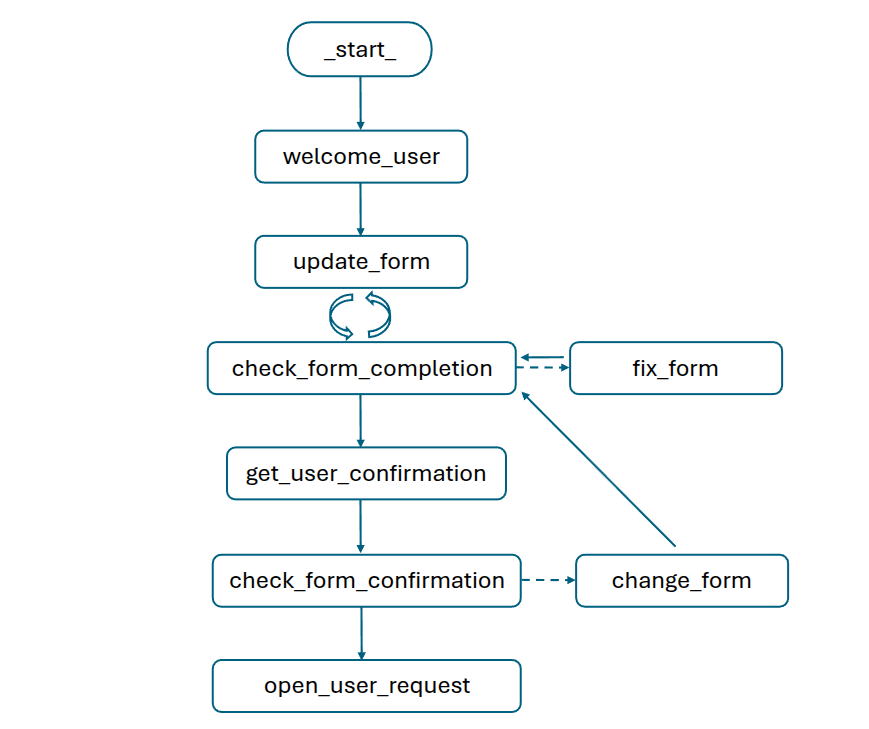

# Call center agent - based on LangMem memory extractor

Call center agent supports voice interactions using:
- [OpenAI's Whisper](https://platform.openai.com/docs/guides/speech-to-text) for speech-to-text
- [Kokoro](https://huggingface.co/spaces/hexgrad/Kokoro-TTS) for text-to-speech

LangMem is used to collect and track information given by the user during the call

### Graph definition

